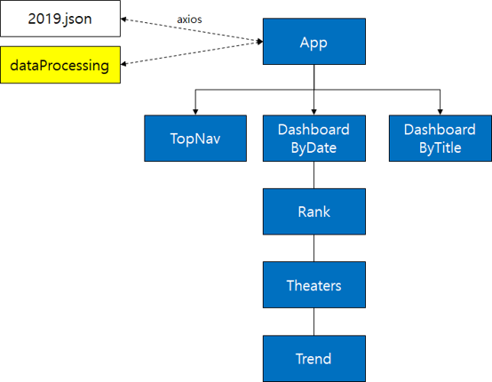

## 대시보드: 1년 전 영화순위

## 소개
본 프로그램은 React 기반의 프론트 엔드 웹 애플리케이션입니다.
2019년 국내 개봉한 영화들의 흥행 순위를 간단한 표와 그래프로 소개합니다.

## 데모
https://master.d1gk1rodzrzeak.amplifyapp.com/

## 기술
백엔드 환경 없이 axios를 통해 내부 json파일의 데이터를 불러와서 구현하였습니다.
사용한 주요 기술들은 아래와 같습니다.
- React
- Highcharts
- Bootstrap
- React Date Picker

## 배포 서버
- AWS Amplify

## 아키텍처

